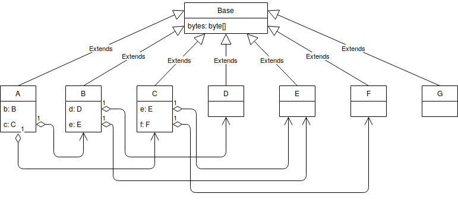
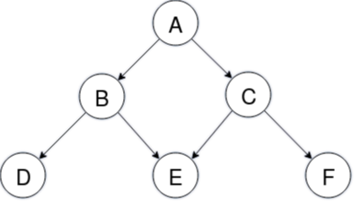
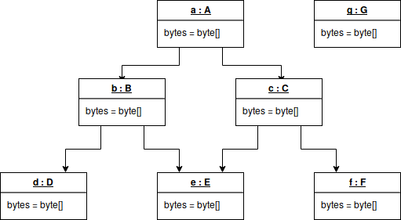

Sample to a show memory references in a Java Application
========================================================

This sample application creates objects from classes `A`, `B`, `C`, `D`, `E`, `F`, and `G`.
Each of the previously mentioned classes extend to `Base` class, which creates a significantly
large byte array in the constructor.

Following is the class diagram.



The application is created to demonstrate the references among objects.

The sample application creates an object from class `A` in the main thread and another object from
class `G` in a daemon thread.

The instance created from class `A` references the instances created from other classes as shown below.



Following is the object diagram showing the object references after the application is started.



### How to run

Use the following command to run the application. The application creates an object from class `A` in
the main thread and another object from class `G` in a daemon thread. After that the application will
wait for a keyboard input.

```bash
java -Xmn1g -Xmx2g -XX:+PrintGC -XX:+PrintGCDetails -XX:+PrintGCDateStamps -javaagent:target/memoryref.jar -jar target/memoryref.jar
```

### Looking at object references using a Heap Dump.

A heap dump can be obtained from following command to look at the object references in heap memory.

```bash
jmap -dump:file=target/heap.hprof $(pgrep -f memoryref)
```

Use [Eclipse Memory Analyzer Tool (MAT)](https://www.eclipse.org/mat/) to analyze the  heap dump.

For more information, read following story based on this sample application.

[Basic concepts of Java heap dump analysis with Eclipse Memory Analyzer Tool (MAT)](https://medium.com/@chrishantha/basic-concepts-of-java-heap-dump-analysis-with-mat-e3615fd79eb)

Note: Images were created using [draw.io](https://www.draw.io/).
